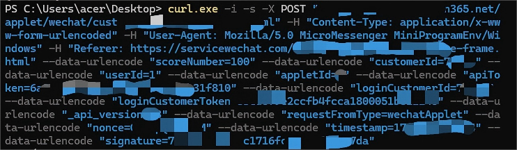
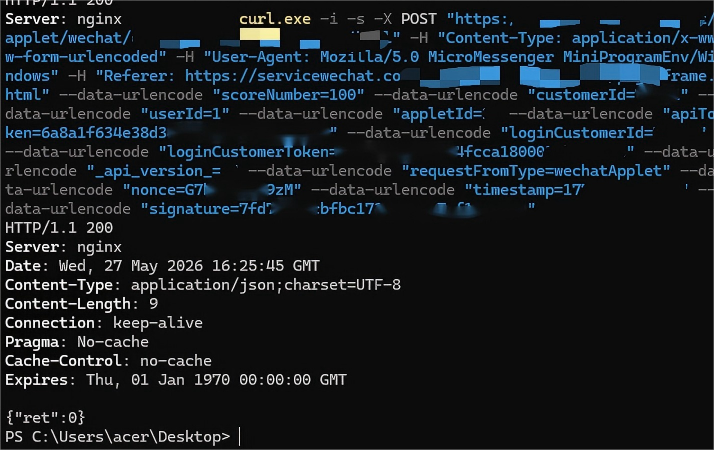
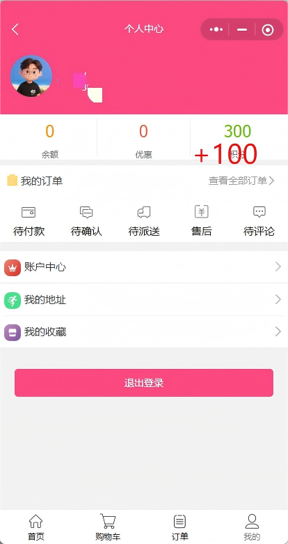

# Redacted Vulnerability Reproduction Report: Incorrect Access Control in a WeChat Mini Program

## Note

All testing activities described in this report were performed using a security testing account. No unauthorized operations were conducted against real user accounts or unrelated business data.

Sensitive fields involved in the demonstration, including authentication tokens, API tokens, request signatures, account identifiers, and other credential-like values, have been redacted. This report is intended to document the vulnerability reproduction process in a responsible disclosure context.

To reduce the risk of misuse before coordinated disclosure or remediation is completed, the vendor name, product name, Mini Program identifier, domain name, exact endpoint path, exact request parameter names, authentication values, request signatures, and directly executable proof-of-concept code are intentionally omitted or generalized.

## Target Overview

The target is a WeChat Mini Program business system that provides functions such as group dining, online shopping, membership management, order management, user points, address management, and product collection.

During testing, a normal user account was used to log in to the Mini Program. Before reproducing the issue, the current points balance of the testing account was recorded from the points page.

**Figure 1. Points balance of the testing account before the request**

## Vulnerability Summary

During testing, an incorrect access control vulnerability was identified in the backend points or reward granting functionality of the WeChat Mini Program.

The affected backend function is intended to grant points or similar account-related rewards under valid business conditions, such as completed transactions, completed tasks, activity rules, or other server-verified events. However, the server-side implementation does not sufficiently enforce authorization checks or business-rule validation before processing the reward-granting operation.

The frontend request related to this function contains user-related identifiers and a reward-related value. After logging in with a normal account, an attacker may reproduce the corresponding backend request outside the Mini Program runtime by using an external HTTP client. By modifying the client-controlled reward value in the request, the attacker may cause the backend to process an unauthorized points increase.

## Reproduction Process

The vulnerability was reproduced in a controlled security testing environment.

The high-level reproduction process is as follows:

1. Log in to the WeChat Mini Program using a normal testing account.
2. Access the points-related page and record the original points balance of the testing account.
3. Obtain and inspect the Mini Program package in the local testing environment.
4. Perform static analysis on the Mini Program source code to identify the backend request related to points or reward granting.
5. Analyze the request format and identify the reward-related value submitted by the client.
6. Use an external HTTP client to reproduce the backend request outside the normal Mini Program interaction flow.
7. Modify the client-controlled reward-related value in the request.
8. Submit the crafted request to the backend service.
9. Observe that the backend returns a successful response.
10. Reopen the points page and verify that the testing account’s points balance has increased.

The following screenshot shows the crafted request used during the reproduction. Sensitive fields and target-specific identifiers have been redacted.

**Figure 2. Crafted request with modified reward-related value**

After submitting the crafted request, the backend returned a successful response, indicating that the request had been accepted and processed.

**Figure 3. Successful backend response after submitting the crafted request**

After the successful response, the points page of the testing account was checked again. The testing account’s points balance had increased, confirming that the backend accepted the client-controlled reward value and applied the points increase.

**Figure 4. Points balance increased after the crafted request**

## Verification Result

In the controlled test, the reward-related value in the request was modified to a larger value. After the crafted request was submitted, the backend returned a successful response, and the points balance of the testing account increased accordingly.

This confirms that the affected backend functionality improperly trusts a client-submitted reward value and fails to sufficiently verify whether the user is authorized or eligible to receive the submitted number of points.

## Root Cause Analysis

The root cause of this vulnerability is insufficient server-side access control and business-rule validation in the points or reward granting process.

Specifically:

* The backend trusts a reward-related value submitted by the client.
* The backend does not sufficiently verify whether the authenticated user is authorized to trigger the reward-granting operation.
* The backend does not sufficiently verify whether the user has completed a legitimate business condition required for receiving the reward.
* The backend does not ensure that the final reward amount is derived from trusted server-side configuration or business records.
* The reward amount can be influenced by a client-controlled request value.

In a secure design, the client should not be able to determine the final number of points or rewards to be granted. The client should only submit event evidence or operation requests, while the server should independently verify the business condition and calculate the reward amount based on trusted server-side rules.

## Vulnerability Type

* Incorrect Access Control
* Missing Authorization
* Business Logic Validation Issue

## Impact

Successful exploitation may allow an authenticated low-privileged user to increase account points or similar account-related benefits without proper authorization.

Potential impacts include:

* Unauthorized increase of account points
* Unauthorized acquisition of platform benefits
* Abuse of coupons, membership benefits, reward points, or similar value-bearing resources
* Financial loss to the platform
* Integrity damage to account reward records
* Need for manual review, rollback, or freezing of abnormal reward records

## Exploitation Conditions

The exploitation requires:

* A valid normal user account
* A valid authenticated session
* The ability to reproduce the backend request outside the normal Mini Program workflow
* The ability to modify the client-controlled reward-related value in the request

No privileged account was required during testing.

## Security Assessment

This issue should be categorized as an incorrect access control vulnerability because a normal authenticated user may be able to perform a reward-granting operation that should only be allowed after strict server-side authorization and business-rule validation.

This issue is not merely a frontend or UI problem. The security boundary must be enforced by the backend service. Even if the request originates from a logged-in user, the backend must verify whether the user is authorized to perform the specific operation and whether the requested reward value is valid.

## Recommended Remediation

The affected backend service should implement strict server-side authorization checks and business-rule validation for all points or reward granting operations.

Recommended remediation measures include:

1. Do not trust client-submitted reward values.
2. Calculate the reward amount entirely on the server side based on trusted business records, such as transaction records, task completion records, activity rules, promotion configurations, or verified event logs.
3. Verify that the authenticated user is authorized to trigger the reward-granting operation.
4. Verify that the user has satisfied the required business condition before granting any points or rewards.
5. Prevent the client from submitting the final reward amount.
6. Enforce idempotency to prevent repeated reward granting for the same business event.
7. Add rate limiting to reward-related backend operations.
8. Add audit logs and risk-control alerts for abnormal reward changes, including large reward increases, frequent reward changes, and reward changes outside normal business flows.
9. Review historical reward records and freeze, roll back, or manually review abnormal records where necessary.
10. After remediation, retest the following scenarios:

    * Client-controlled reward value manipulation
    * Repeated reward requests
    * Reward granting without valid business conditions
    * Cross-account authorization checks
    * Direct backend request submission outside the normal Mini Program workflow

## Disclosure Status

This report is currently redacted for responsible disclosure.

The following information is intentionally not disclosed in this public version:

* Vendor name
* Product name
* Mini Program name
* Mini Program identifier
* Domain name
* Exact endpoint path
* Exact request parameter names
* Authentication tokens
* API tokens
* Request signatures
* Account identifiers
* Full HTTP request
* Full HTTP response
* Executable proof-of-concept code

Additional details may be published after coordinated disclosure, vendor remediation, or publication by an authorized vulnerability coordination body.

## Credits

Discovered by Runtian Xiao.
