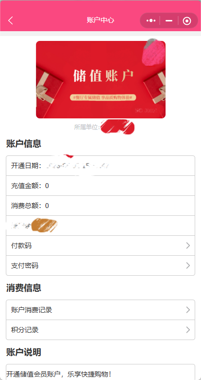
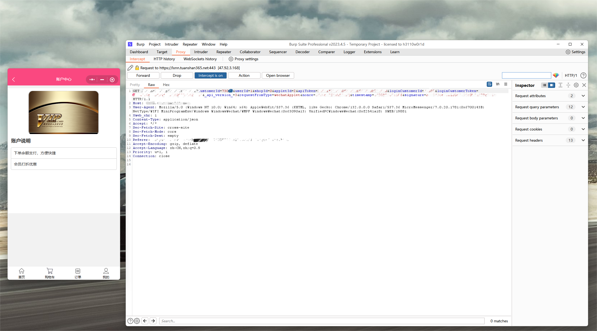
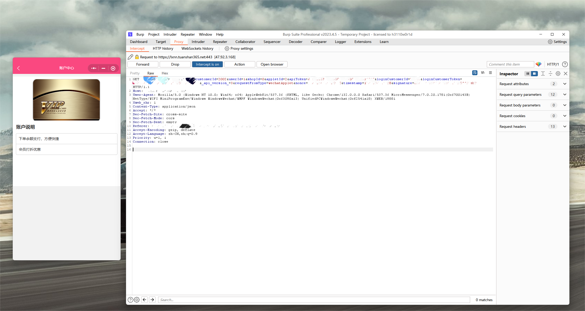
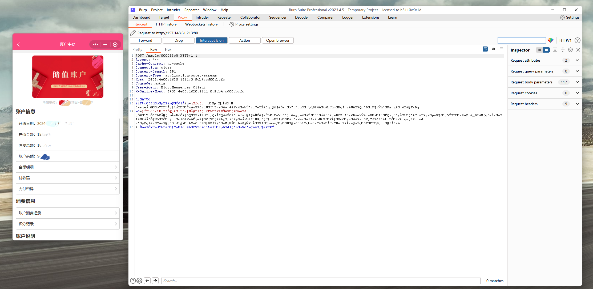
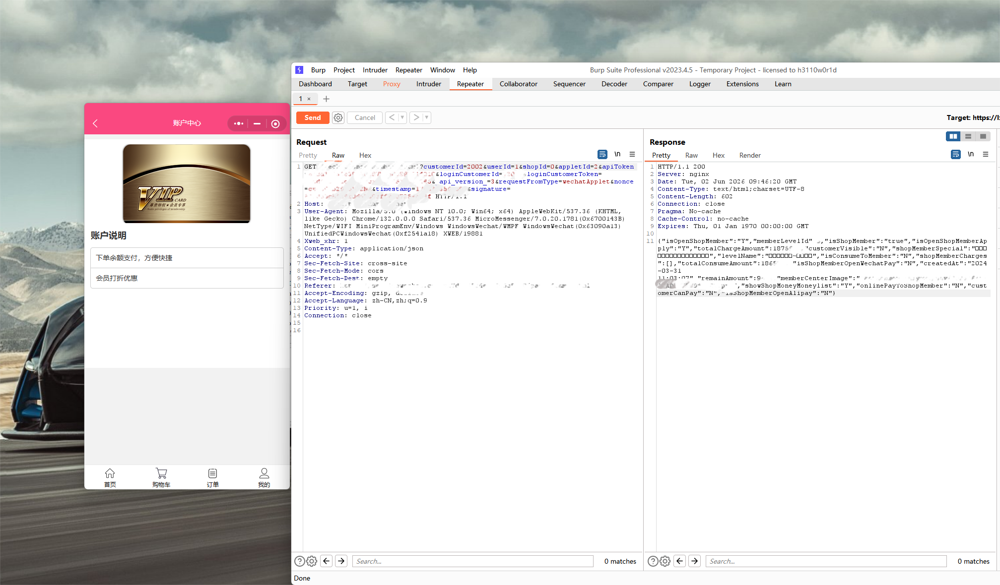

# Redacted Vulnerability Reproduction Report: IDOR in a WeChat Mini Program Member Query Interface

## Note

All testing activities described in this report were performed using authorized security testing accounts and limited verification. No unauthorized operations were conducted against real user accounts, no business actions were performed on behalf of other users, and no large-scale enumeration was conducted.

Sensitive fields involved in the demonstration, including authentication tokens, API tokens, request signatures, account identifiers, user identifiers, member identifiers, domain names, endpoint paths, and other credential-like values, have been redacted or generalized.

This report is intended to document the vulnerability reproduction process in a responsible disclosure context. To reduce the risk of misuse before coordinated disclosure or remediation is completed, this public version intentionally omits the vendor name, product name, Mini Program identifier, exact domain, exact endpoint path, exact request parameter names, authentication values, request signatures, concrete account identifiers, full HTTP requests, full HTTP responses, bulk enumeration scripts, and directly executable proof-of-concept code.

## Target Overview

The target is a WeChat Mini Program business system that provides functions such as group dining, online shopping, membership management, order management, user points, address management, and product collection.

The affected function is a member query feature. In the normal Mini Program workflow, the frontend queries membership information for the currently logged-in user. However, the backend request contains a client-controllable member identifier. This identifier is used by the backend to locate the target member record.

In a secure design, a logged-in user should only be able to query member information associated with the current authenticated account. The backend should derive the target member identity from a trusted server-side session or a server-validated authentication token, rather than trusting a client-supplied member identifier.



**Figure 5. Member center page accessed by the authenticated testing account**

## Vulnerability Summary

An insecure direct object reference vulnerability was identified in the backend member query functionality of the WeChat Mini Program.

The affected backend function accepts a client-controllable member identifier as the target object key. After logging in with a normal user account, a requester can reproduce the member query request and modify this identifier to reference a member object that does not belong to the authenticated account.

The backend does not sufficiently verify whether the requested member identifier belongs to the currently authenticated user. As a result, a normal authenticated user may be able to obtain member information or member status associated with another member object.

The member identifier appears to be a predictable numeric identifier. If no effective object-level authorization, rate limiting, or anomaly detection is enforced, iterative probing of the identifier space may allow an attacker to discover valid member identifiers at scale and retrieve detailed membership account information associated with those identifiers.

This issue is an object-level authorization failure. The security boundary should be enforced by the backend service, not by the Mini Program frontend or by the assumption that users will not modify request parameters.

## Reproduction Process

The vulnerability was reproduced through controlled testing and limited identifier probing. Broad enumeration was not performed.

The high-level reproduction process is as follows:

1. Log in to the WeChat Mini Program using a normal testing account.
2. Access the member-related page and capture the normal member query request generated by the authenticated account.
3. Inspect the request and identify the client-controllable member identifier used by the backend to select the target member record.
4. Modify the member identifier to another valid numeric member identifier that is not associated with the authenticated requester.
5. Submit the modified request under the original authenticated context.
6. Observe that the backend returns a successful response.
7. Verify that the returned data corresponds to the modified member identifier rather than the authenticated requester.
8. Review the returned fields and confirm that the response includes membership status and value-bearing membership account attributes, especially monetary account fields such as remaining balance, cumulative recharge amount, and cumulative consumption amount.

The following screenshot shows the normal member query request generated by the authenticated testing account. Sensitive values and target-specific identifiers have been redacted.



**Figure 6. Normal member query request generated by the authenticated testing account**

The following screenshot shows the modified member query request. The client-controllable member identifier was replaced with a different valid member identifier. Authentication values, request signatures, account identifiers, exact endpoint paths, and exact parameter names have been redacted or generalized.



**Figure 7. Modified member query request with a different member identifier**

After submitting the modified request, the Mini Program page state reflected membership data associated with the modified member identifier. This indicates that the backend accepted the non-owned member identifier and returned data that affected the displayed member-related state.



**Figure 8. Page state after modifying the member identifier**

The returned data was further reviewed to determine whether the issue was limited to simple member existence disclosure. The response contained multiple membership account fields, including member status, account balance, cumulative recharge amount, cumulative consumption amount, membership level, creation time, and payment-related configuration flags.



**Figure 9. Redacted response fields showing membership status and value-bearing account attributes**

## Redacted Response Sample

The following redacted sample illustrates the type of data returned by the affected interface after the member identifier was modified. Concrete identifiers, project names, timestamps, numeric amounts, resource paths, and target-specific values have been redacted.

```json
{
  "isOpenShopMember": "Y",
  "memberLevelId": "[REDACTED_MEMBER_LEVEL_ID]",
  "isShopMember": "true",
  "isOpenShopMemberApply": "Y",
  "totalChargeAmount": "[REDACTED_TOTAL_RECHARGE_AMOUNT]",
  "customerVisible": "[REDACTED_FLAG]",
  "shopMemberSpecial": "[REDACTED_MEMBER_PROMOTION_TEXT]",
  "levelName": "[REDACTED_PROJECT_OR_MEMBER_LEVEL_NAME]",
  "isConsumeToMember": "[REDACTED_FLAG]",
  "shopMemberCharges": "[REDACTED_ARRAY]",
  "totalConsumeAmount": "[REDACTED_TOTAL_CONSUMPTION_AMOUNT]",
  "isShopMemberOpenWechatPay": "[REDACTED_FLAG]",
  "createdAt": "[REDACTED_ACCOUNT_CREATION_TIME]",
  "remainAmount": "[REDACTED_REMAINING_BALANCE]",
  "memberCenterImage": "[REDACTED_RESOURCE_PATH]",
  "showShopMoneyMoneylist": "[REDACTED_FLAG]",
  "onlinePayToShopMember": "[REDACTED_FLAG]",
  "customerCanPay": "[REDACTED_FLAG]",
  "isShopMemberOpenAlipay": "[REDACTED_FLAG]"
}
```

The returned fields show that the issue is not limited to disclosing whether a member identifier exists. The affected interface may expose value-bearing membership account information, including membership activation status, member level, project or membership affiliation, cumulative recharge amount, cumulative consumption amount, remaining balance, account creation time, membership promotion text, resource paths, and payment-related configuration flags.

In particular, fields such as `isShopMember`, `isOpenShopMember`, `totalChargeAmount`, `totalConsumeAmount`, `remainAmount`, `levelName`, and `createdAt` indicate that the response may contain sensitive membership account status, stored-value related information, consumption-related statistics, and business affiliation information.

The monetary fields are particularly sensitive. If valid member identifiers can be discovered through identifier probing, the issue may expose the remaining balance, cumulative recharge amount, and cumulative consumption amount of multiple member accounts.

## Verification Result

The vulnerability was verified by modifying the client-controllable member identifier in an authenticated member query request.

When the identifier was changed to a valid member identifier outside the authenticated user's account scope, the backend returned membership information associated with the modified identifier. This confirms that the affected backend functionality improperly trusts a client-controllable object key and does not sufficiently verify whether the authenticated user is authorized to access the requested member object.

Limited testing also indicated that the member identifier appears to be a predictable numeric identifier. This increases the practical exploitability of the vulnerability because valid member identifiers may be discoverable through low-volume probing. No large-scale enumeration was conducted.

If the identifier space is sequential or otherwise predictable, and if the backend lacks effective authorization checks and rate limiting, an attacker could potentially iterate over the identifier space to discover valid member identifiers at scale. For each valid identifier, the affected interface may return detailed membership account information, including monetary fields.

## Root Cause Analysis

The root cause of this vulnerability is missing or insufficient object-level authorization in the member query process.

Specifically:

* The backend accepts a client-controllable member identifier as the target member object.
* The backend does not sufficiently verify whether the requested member identifier belongs to the authenticated session.
* The backend does not enforce a strict binding between the authenticated user identity and the requested member object.
* The backend appears to use request parameters to determine the target member record instead of deriving the target identity entirely from trusted server-side session data.
* A normal authenticated user may access member objects outside the user's authorization scope by modifying the request parameter.
* The member identifier appears to be numeric and potentially predictable, which increases the risk of valid member discovery and broad member data exposure.

In a secure design, the backend should derive the current user identity from a trusted server-side session, authentication token, or equivalent server-validated credential. The client should not be allowed to choose an arbitrary member object for a personal member information query.

## Vulnerability Type

* Incorrect Access Control
* Insecure Direct Object Reference
* Broken Object Level Authorization
* Missing Authorization

## CWE Mapping

* CWE-639: Authorization Bypass Through User-Controlled Key
* CWE-862: Missing Authorization

## Impact

Successful exploitation may allow an authenticated low-privileged user to access member information associated with other users.

Potential impacts include:

* Unauthorized access to another user's member status
* Unauthorized access to member profile information
* Enumeration or discovery of valid member identifiers
* Potential large-scale discovery of member identifiers if the identifier space is predictable and no effective rate limiting is enforced
* Disclosure of account-related membership information
* Disclosure of value-bearing membership account attributes
* Disclosure of remaining membership balance
* Disclosure of cumulative recharge amount
* Disclosure of cumulative consumption amount
* Disclosure of member level or project affiliation
* Disclosure of account creation time
* Disclosure of membership payment configuration flags
* Increased risk of follow-up abuse against member-related business functions

The presence of fields such as membership status, remaining amount, total recharge amount, total consumption amount, membership level, project-related level name, and account creation time indicates that the exposed data may include sensitive business and value-bearing membership account information.

The most sensitive part of the response is the monetary account information. Exposure of `remainAmount`, `totalChargeAmount`, and `totalConsumeAmount` may reveal the remaining stored-value balance, historical recharge amount, and historical consumption amount of member accounts.

If valid member identifiers can be discovered through identifier probing, this vulnerability may allow an attacker to collect detailed membership account information for multiple users, rather than only accessing a single isolated record.

This issue should not be treated as a frontend-only problem. Although the Mini Program frontend normally submits the current user's own member identifier, an attacker can reproduce and modify the backend request outside the expected frontend workflow. Therefore, the backend must enforce authorization independently.

## Exploitation Conditions

The exploitation requires:

* A valid normal user account
* A valid authenticated session
* The ability to reproduce the member query request outside the normal Mini Program workflow
* Knowledge of, or ability to obtain, another valid member identifier
* The ability to modify the client-controllable member identifier in the request

No privileged account was required during testing.

## Security Impact

The affected member query function exposes membership data associated with a client-controllable member identifier. When the identifier is modified to another valid member identifier, the backend may return membership data that does not belong to the authenticated requester.

This behavior indicates that the backend does not sufficiently enforce object-level authorization for member information access. The issue allows an authenticated user to access membership information outside the user's own account scope.

The returned data is not limited to a simple member-existence indicator. The response may include membership status, member level, account creation time, cumulative recharge amount, cumulative consumption amount, remaining balance, and payment-related membership configuration flags.

These fields may reveal value-bearing membership account information and business affiliation information. Therefore, the issue has a higher business impact than ordinary user enumeration or simple member-existence disclosure.

Because the member identifier appears to be numeric and predictable, the issue may also enable member identifier discovery. If the backend does not enforce effective rate limiting or anomaly detection, iterative identifier probing could expose a broad set of valid member identifiers and their associated account details.

Potential impacts include:

* Unauthorized access to another user's membership status
* Discovery of valid member identifiers through predictable numeric identifier probing
* Potential broad exposure of detailed membership account information if identifiers are probed at scale
* Disclosure of value-bearing membership account attributes
* Disclosure of remaining balance, cumulative recharge amount, or cumulative consumption amount
* Disclosure of member level, project affiliation, or account creation time

This advisory focuses only on unauthorized member information access through the member query function. Other security-sensitive member functions are not discussed in this report.

## Recommended Remediation

The affected backend service should implement strict server-side object-level authorization for all member query operations.

Recommended remediation measures include:

1. Do not trust client-submitted member identifiers for personal member information queries.
2. Derive the current user identity exclusively from trusted server-side session data, authentication tokens, or equivalent server-validated credentials.
3. Before returning any member information, verify that the requested member object belongs to the authenticated user.
4. Reject requests where the requested member identifier does not match the authenticated user's server-side identity.
5. Avoid returning unnecessary sensitive member fields in the response.
6. Mask or minimize value-bearing membership account attributes unless they are strictly required.
7. Add rate limiting and anomaly detection for repeated member identifier probing.
8. Add audit logs for cross-account access attempts and abnormal member query patterns.
9. Ensure that request signatures, if used, cover all security-sensitive parameters, including the member identifier, user identifier, shop identifier, request path, HTTP method, timestamp, and nonce.
10. Invalidate or rotate exposed authentication credentials if any credential leakage is suspected.
11. After remediation, retest the following scenarios:

    * Querying the current authenticated user's own member information
    * Querying another user's member information using a modified member identifier
    * Querying non-existing member identifiers
    * Replaying old member query requests
    * Performing repeated member identifier probing
    * Submitting member query requests outside the normal Mini Program workflow

## Disclosure Status

This report is currently redacted for responsible disclosure.

The following information is intentionally not disclosed in this public version:

* Vendor name
* Product name
* Mini Program name
* Mini Program identifier
* Domain name
* Exact endpoint path
* Exact request parameter names
* Authentication tokens
* API tokens
* Request signatures
* Account identifiers
* User identifiers
* Member identifiers
* Full HTTP request
* Full HTTP response
* Bulk enumeration script
* Executable proof-of-concept code
* Personal information or real user data
* Concrete project names
* Concrete numeric balances, recharge amounts, and consumption amounts

Additional details may be published after coordinated disclosure, vendor remediation, or publication by an authorized vulnerability coordination body.

## Credits

Discovered by Runtian Xiao.
