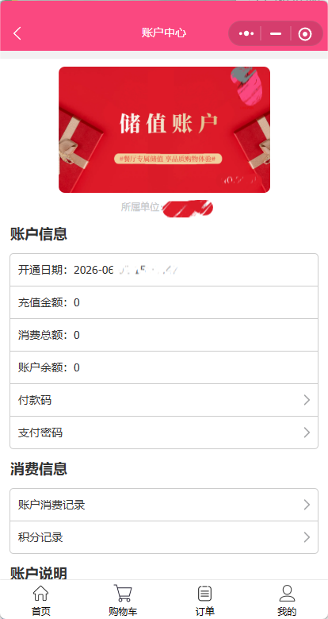
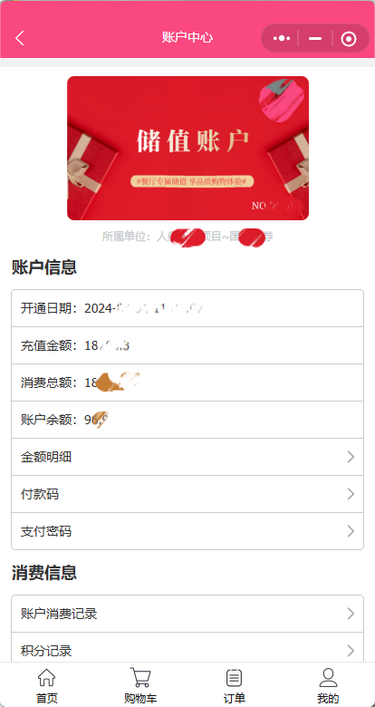
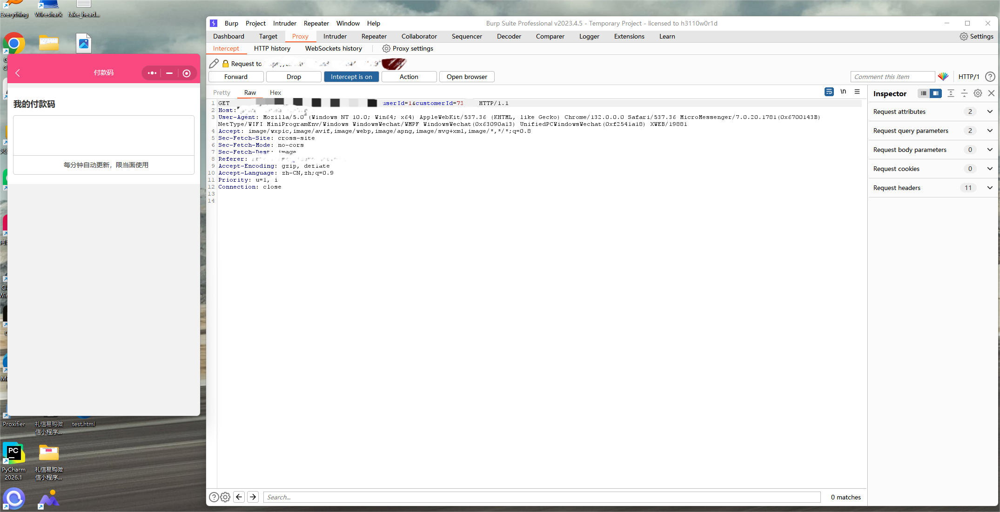
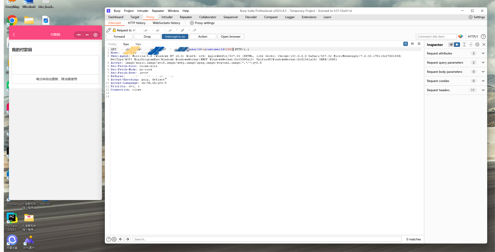
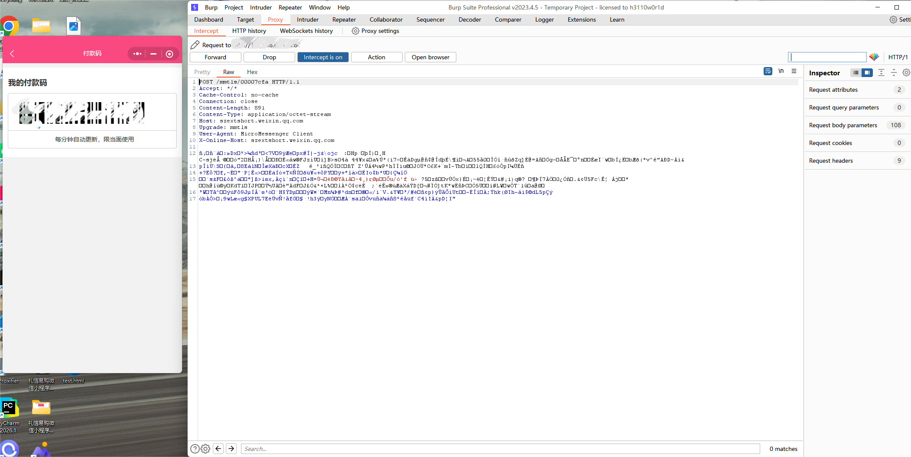
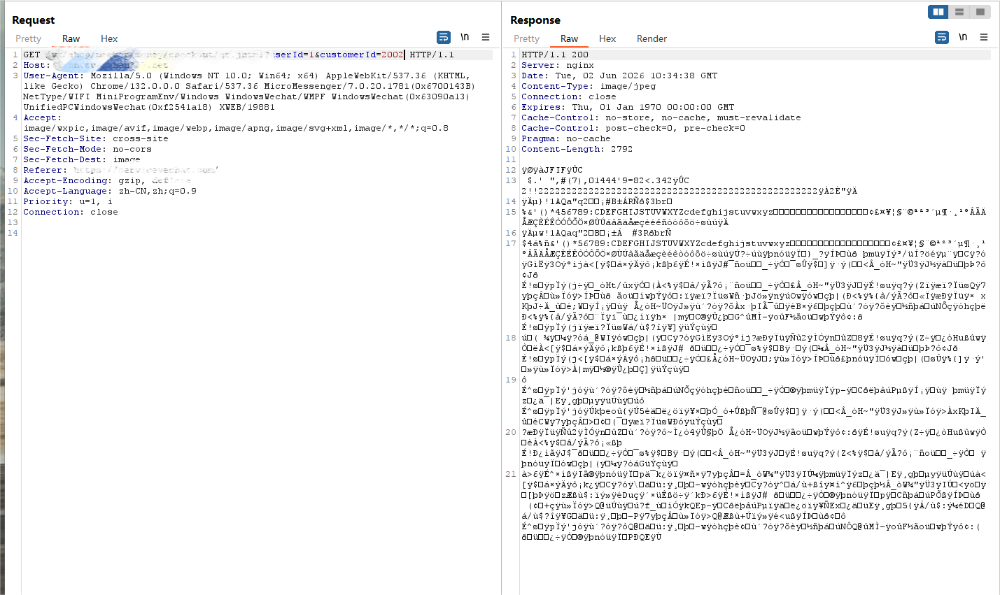

# Redacted Vulnerability Reproduction Report: Unauthorized Payment Code Retrieval via Client-Controllable Member Identifier in a WeChat Mini Program

## Note

All testing activities described in this report were performed using authorized security testing accounts and controlled verification. No unauthorized payment, consumption, recharge, refund, account modification, or business operation was performed against real users.

Sensitive fields involved in the demonstration, including authentication tokens, API tokens, request signatures, account identifiers, user identifiers, member identifiers, payment code contents, domain names, endpoint paths, and other credential-like values, have been redacted or generalized.

This report is intended to document the vulnerability reproduction process in a responsible disclosure context. To reduce misuse risk before coordinated disclosure or remediation is completed, this public version intentionally omits the vendor name, product name, Mini Program identifier, exact domain, exact endpoint path, exact request parameter names, authentication values, concrete account identifiers, full HTTP requests, full HTTP responses, executable proof-of-concept code, and any usable payment code content.

## Target Overview

The target is a WeChat Mini Program business system that provides functions such as group dining, online shopping, membership management, member stored-value accounts, order management, user points, and payment-related member services.

The affected function is a member payment code retrieval feature. In the normal Mini Program workflow, the frontend requests the payment code associated with the currently logged-in user's own member account. However, the backend request contains a client-controllable member identifier. This identifier is used by the backend to determine which member account's payment code should be returned.

In a secure design, a payment code should only be generated or returned for the currently authenticated member account. The backend should derive the target member identity from trusted server-side session data or server-validated credentials, rather than trusting a client-supplied member identifier.

This advisory is related to, but separate from, the member information IDOR issue documented in another report. The first issue allows unauthorized access to membership account details such as member status and monetary fields. This second issue demonstrates that a client-controllable member identifier can also affect a payment-code-related function.



**Figure 10. Source testing account with no available member balance**



**Figure 11. Target member account with available member balance and monetary account details**

## Vulnerability Summary

An incorrect access control vulnerability was identified in the backend member payment code retrieval functionality of the WeChat Mini Program.

The affected backend function accepts a client-controllable member identifier as the target object key. After logging in with a normal low-privileged user account, a requester can reproduce a legitimate payment-code-related request and modify the member identifier to reference another valid member account.

The backend does not sufficiently verify whether the requested member identifier belongs to the currently authenticated user before returning the payment code associated with that member account. As a result, a normal authenticated user may be able to retrieve a payment code for a member account that does not belong to the authenticated requester.

This issue is more severe than ordinary member information disclosure because the returned object is related to a payment or stored-value consumption workflow. In the verified case, modifying the member identifier caused the Mini Program to receive or display payment-code-related content associated with a non-owned member account.

If a payment code generated for another member account can be presented in a business payment scenario, the vulnerability may enable unauthorized use of another member's stored-value balance or payment capability, depending on downstream payment verification controls.

## Observed Identifier Pattern and Affected Population

During testing, the member identifier appeared to be a sequential numeric identifier. Later-created member accounts appeared to have larger identifier values. Based on the observed identifier range, the potential affected population is estimated to exceed 70,000 member accounts.

The affected member accounts appear to include users associated with important organizations, enterprise projects, and group dining or membership-based business scenarios. Therefore, the business impact is not limited to ordinary account data exposure. The issue may affect members whose accounts contain stored-value balance, recharge history, consumption history, project affiliation, and payment capability.

The sequential nature of the member identifier significantly increases practical exploitability. If no effective object-level authorization, rate limiting, or anomaly detection is enforced, valid member identifiers may be discovered at scale through identifier probing.

## Relationship with Member Information Disclosure

This payment-code access-control issue is directly related to the member information disclosure vulnerability disclosed in the following advisory:

[Member Information Disclosure Advisory](https://github.com/XRTyyds/responsible-disclosure-advisory/blob/main/advisory01.md)

The member information disclosure vulnerability shows that a client-controllable member identifier can be used to access membership account details belonging to other users. The exposed data includes membership status, member level, remaining balance, cumulative recharge amount, cumulative consumption amount, account creation time, and payment-related configuration flags.

When combined with that issue, this payment-code vulnerability becomes significantly more dangerous. An attacker would not need to blindly guess which member identifiers are valuable. Instead, the attacker could first use the member information disclosure issue to discover valid member identifiers and identify accounts with remaining stored-value balance, and then use those identifiers to request payment codes through the affected payment-code retrieval interface.

The combined risk is therefore:

1. discover or confirm valid member identifiers;
2. identify member accounts with remaining balance or other value-bearing attributes;
3. request a payment code by substituting the target member identifier in a payment-code-related backend request;
4. obtain a payment code associated with another member account.

No unauthorized consumption was performed during testing. The risk described here is based on the verified ability to retrieve a payment code for a non-owned member identifier and the payment-related nature of the returned object.

## Reproduction Process

The vulnerability was reproduced through controlled testing using authorized security testing accounts. Broad enumeration was not performed, and no payment or consumption operation was executed.

The high-level reproduction process is as follows:

1. Log in to the WeChat Mini Program using a normal testing account.
2. Confirm that the source testing account does not have available member balance or does not represent the target value-bearing member account.
3. Identify a separate target member identifier whose membership account has available balance or value-bearing account information.
4. Access the member payment-code-related function in the normal Mini Program workflow and capture the legitimate payment code request generated for the source testing account.
5. Inspect the request and identify the client-controllable member identifier used by the backend to select the target member account.
6. Modify the member identifier from the source testing account's identifier to the target member identifier.
7. Submit the modified request under the original authenticated session.
8. Observe that the backend returns a payment-code-related response for the modified target member identifier.
9. Confirm that the Mini Program displays or receives the payment code associated with the target member identifier.

The following screenshot shows the original payment-code-related request before modifying the member identifier. Sensitive values and target-specific identifiers have been redacted.



**Figure 12. Original payment code request before modifying the member identifier**

The following screenshot shows the modified payment-code-related request. The client-controllable member identifier was changed from the source account identifier to a different target member identifier. Authentication values, exact endpoint paths, concrete identifiers, and payment-related sensitive values have been redacted or generalized.



**Figure 13. Modified payment code request using a different member identifier**

After submitting the modified request, the Mini Program displayed a payment code associated with the modified target member identifier. This indicates that the backend accepted the non-owned member identifier and returned payment-code-related content for that member account.



**Figure 14. Payment code displayed after modifying the member identifier**

The backend response to the modified request was further reviewed. The response contained payment-code-related image/content data associated with the requested target member identifier. Any usable payment code content has been redacted in this public report.



**Figure 15. Redacted response content after requesting the payment code with a modified member identifier**

## Redacted Request Pattern

The following redacted pattern illustrates the affected request structure. The exact domain, endpoint path, concrete identifiers, and request headers have been omitted from this public version.

```http
GET /[REDACTED_PAYMENT_CODE_ENDPOINT]?[REDACTED_USER_PARAMETER]=[REDACTED]&[REDACTED_MEMBER_IDENTIFIER_PARAMETER]=[REDACTED_TARGET_MEMBER_ID] HTTP/1.1
Host: [REDACTED_DOMAIN]
User-Agent: [REDACTED_WECHAT_MINI_PROGRAM_USER_AGENT]
Referer: [REDACTED_WECHAT_MINI_PROGRAM_REFERER]
Accept: image/*
```

The key security issue is that the backend accepts a client-controllable member identifier in a payment-code-related request and does not sufficiently enforce that the requested member identifier belongs to the authenticated requester.

## Verification Result

The vulnerability was verified by modifying the client-controllable member identifier in an authenticated payment-code-related request.

In the verified case, the source testing account and the target member account were different. The source testing account did not represent the target value-bearing member account, while the target member identifier was associated with a member account that had available monetary account information.

After the member identifier was modified in the payment-code-related request, the backend returned payment-code-related content for the target member identifier. This confirms that the affected backend functionality improperly trusts a client-controllable object key and does not sufficiently verify whether the authenticated user is authorized to retrieve the requested member payment code.

The verified behavior shows that the payment-code-related response is controlled by the client-supplied member identifier rather than being strictly bound to the authenticated session.

## Root Cause Analysis

The root cause of this vulnerability is missing or insufficient object-level authorization in the member payment code retrieval process.

Specifically:

* The backend accepts a client-controllable member identifier in a payment-code-related request.
* The backend uses this identifier to select the target member account for payment code generation or retrieval.
* The backend does not sufficiently verify whether the requested member identifier belongs to the currently authenticated session.
* The backend does not enforce a strict binding between the authenticated user identity and the requested payment-code member object.
* A normal authenticated user may retrieve payment-code-related content for a member account outside the user's authorization scope by modifying the request parameter.
* If valid member identifiers and balance information can be obtained from another access-control issue, the practical risk of this payment-code vulnerability is significantly increased.

In a secure design, the backend should never allow the client to choose an arbitrary member account for payment code retrieval. The payment code should be generated only for the member account that is cryptographically or server-side bound to the authenticated session.

## Vulnerability Type

* Incorrect Access Control
* Insecure Direct Object Reference
* Broken Object Level Authorization
* Missing Authorization
* Unauthorized Access to Payment-Related Member Function

## CWE Mapping

* CWE-639: Authorization Bypass Through User-Controlled Key
* CWE-862: Missing Authorization
* CWE-284: Improper Access Control

## Impact

Successful exploitation may allow an authenticated low-privileged user to retrieve a payment code associated with another member account.

Potential impacts include:

* Unauthorized retrieval of another member account's payment code
* Unauthorized access to payment-code-related member functionality
* Exposure of payment-related member credentials or payment authorization artifacts
* Potential unauthorized consumption of another member's stored-value balance if the payment code is accepted by downstream business payment workflows
* Abuse of member accounts that have remaining balance or other value-bearing attributes
* Increased risk when combined with unauthorized member information disclosure, because valid member identifiers and balance information can be used to select valuable targets
* Loss of confidentiality and integrity for member payment workflows
* Financial or business impact if the retrieved payment code can be used for actual consumption

This issue has a higher business impact than ordinary profile information disclosure because the affected function is payment-related and may involve value-bearing member account operations. The verified behavior shows that the payment-code-related response can be influenced by a client-controllable member identifier.

The risk is amplified by the apparent sequential nature of the member identifier. If the identifier space can be iterated and no effective rate limiting, anomaly detection, or object-level authorization is enforced, valid member accounts may be discovered at scale.

Because the related member information disclosure issue can reveal whether a member account has remaining balance, cumulative recharge amount, and cumulative consumption amount, attackers may be able to prioritize accounts with higher stored-value balances. This turns the issue from a single-record payment-code retrieval problem into a potentially large-scale payment-related account abuse risk.

The most severe scenario is a chained attack in which valid member identifiers are discovered through the member information disclosure vulnerability, member accounts with available balance are selected, and payment codes are retrieved through this payment-code access-control vulnerability. If the payment code can then be used for consumption without additional ownership checks, all affected member accounts with available balance may be exposed to serious financial loss.

## Exploitation Conditions

The exploitation requires:

* A valid normal user account
* A valid authenticated session
* The ability to reproduce a payment-code-related request generated by the WeChat Mini Program
* Knowledge of, or ability to obtain, another valid member identifier
* The ability to modify the client-controllable member identifier in the request
* A target member account with available balance or payment capability for greater practical impact

No privileged account was required during testing. No unauthorized consumption or payment transaction was performed.

## Security Impact

The affected payment code retrieval function exposes payment-code-related content based on a client-controllable member identifier. When the identifier is modified to another valid member identifier, the backend may return a payment code associated with a member account that does not belong to the authenticated requester.

This behavior indicates that the backend does not sufficiently enforce object-level authorization for payment-code-related member access. The issue allows an authenticated user to access payment-code-related functionality outside the user's own account scope.

The impact is particularly serious because the returned object is not merely descriptive account data. It is payment-related content that may be used in a consumption or stored-value payment workflow. If downstream verification relies on the payment code itself and does not independently re-check account ownership, the issue may enable unauthorized use of another member's balance.

When combined with member information exposure, the attack surface becomes broader. An attacker may first identify valid member identifiers and accounts with remaining balance, then use those identifiers to request payment codes through the affected payment-code endpoint.

The combined impact may therefore affect a large number of member accounts. If payment codes obtained through modified member identifiers are accepted by downstream business payment workflows without independent server-side ownership verification, the vulnerability may lead to unauthorized consumption of member stored-value balances and cause severe financial losses to affected members.

Suggested business severity:

`High`

Higher severity may be justified if the retrieved payment code can be used directly to complete a transaction, redeem stored value, or consume another member account's balance without additional ownership verification.

## Recommended Remediation

The affected backend service should implement strict server-side object-level authorization for all payment-code-related member operations.

Recommended remediation measures include:

1. Do not trust client-submitted member identifiers for payment code generation or retrieval.
2. Derive the current member identity exclusively from trusted server-side session data, authentication tokens, or equivalent server-validated credentials.
3. Before returning any payment code, verify that the requested member account belongs to the authenticated user.
4. Reject requests where the requested member identifier does not match the authenticated user's server-side identity.
5. Bind payment codes to the authenticated session, device, user identity, member account, timestamp, nonce, and payment context.
6. Ensure that payment codes are short-lived and single-use where applicable.
7. Ensure that downstream payment or consumption verification re-checks account ownership and authorization server-side.
8. Do not allow payment code generation based only on a client-supplied member identifier.
9. Add rate limiting and anomaly detection for repeated member identifier probing and payment code retrieval attempts.
10. Add audit logs for cross-account payment-code access attempts and abnormal payment-code generation patterns.
11. Invalidate or rotate any exposed payment-code-related tokens or credentials if leakage is suspected.
12. After remediation, retest the following scenarios:

    * Requesting the current authenticated user's own payment code
    * Requesting another member's payment code by modifying the member identifier
    * Requesting a payment code for a non-existing member identifier
    * Replaying old payment-code requests
    * Reusing previously generated payment codes
    * Attempting payment-code retrieval outside the normal Mini Program workflow
    * Attempting payment or consumption with a payment code after ownership checks are enforced

## Disclosure Status

This report is currently redacted for responsible disclosure.

The following information is intentionally not disclosed in this public version:

* Vendor name
* Product name
* Mini Program name
* Mini Program identifier
* Domain name
* Exact endpoint path
* Exact request parameter names
* Authentication tokens
* API tokens
* Request signatures
* Account identifiers
* User identifiers
* Member identifiers
* Payment code content
* Full HTTP request
* Full HTTP response
* Executable proof-of-concept code
* Personal information or real user data
* Concrete balances, recharge amounts, and consumption amounts

Additional details may be published after coordinated disclosure, vendor remediation, or publication by an authorized vulnerability coordination body.

## Credits

Discovered by Runtian Xiao.
